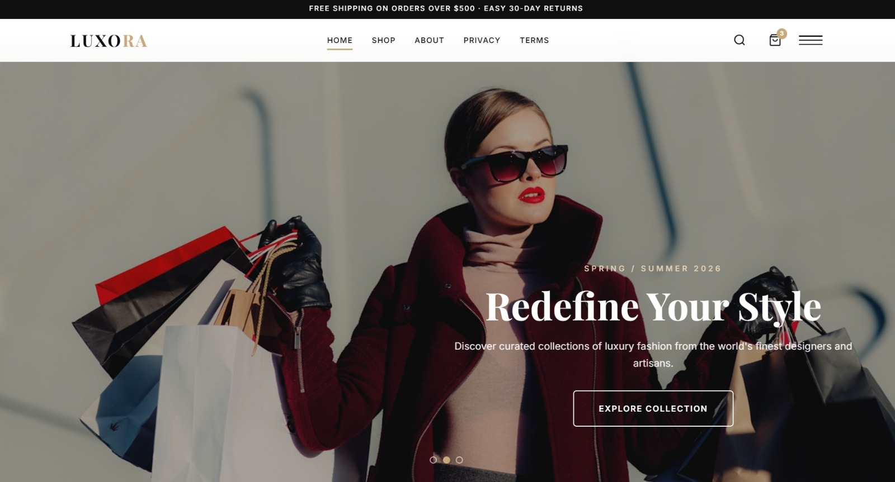

# 🛍️ Luxury Fashion Store — LUXORA

A responsive, modern luxury fashion e-commerce platform featuring curated collections of premium clothing, footwear, and accessories.

---

## ✨ Features

- 🛒 **Shopping Cart** — Add/remove items with live count badge
- 🔍 **Product Search** — Filter products instantly
- 📱 **Fully Responsive** — Works on all screen sizes
- 🗂️ **Multi-page Navigation** — Home, Shop, About, Privacy, Terms
- 👗 **Curated Collections** — Clothing, footwear, and accessories
- 🚚 **Announcement Bar** — Free shipping & returns info

---

## 🛠️ Tech Stack

- **Frontend:** HTML5, CSS3, Vanilla JavaScript
- **Architecture:** Multi-page SPA with dynamic routing
- **Deployment:** GitHub Pages

---

## 🚀 Live Demo

🔗 [abdoibrahim20.github.io/Luxury-Fashion-Store](https://abdoibrahim20.github.io/Luxury-Fashion-Store)

---

## 📁 Project Structure
Luxury-Fashion-Store/
├── index.html      # Main entry point
├── app.js          # Core application logic
├── data.js         # Products data
├── pages.js        # Page routing
└── styles.css      # Styling
---

## 🤝 Contact

**Abdelrahman Nasef** — Available for Freelance
📧 nasefabdo600@gmail.com

